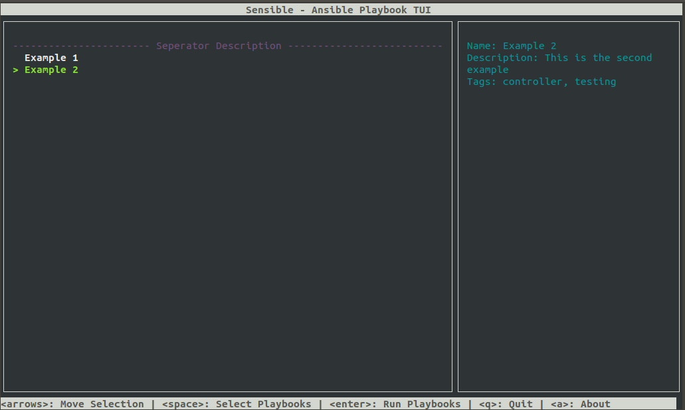

# Sensible (**Under Development**)

An Ansible Playbook TUI



# Project Layout
Utilizing the below directory layout, the following command would be ran to start the TUI:
```bash
./sensible.py --dir=.
```

```
|- sensible.py
|
|- ansible.cfg
|
|-inventory/
|  |- inventory.yaml
|
|- playbooks/
|  |- example-1.yaml
|  |- example-2.yaml
|  |- seperator.yaml
|
|- roles/
|  |- common/
|  |  |- tasks/
|  |  |  |- main.yml
```

# Header Format

Below is an example Sensible header inside a playbook

```yaml
#!/usr/bin/env ansible-playbook
---

### sensible ###
# - name: Example Header
# - description: >
#     This is an example
# - index: 2
# - tags:
#   - controller
#   - testing
### /sensible ###

- name: "Test"
  hosts: localhost
  connection: local
  gather_facts: true
  tasks:
    - name: "Test Task"
      shell: |
        ls ~
      register: result

    - debug: var=result

...
```